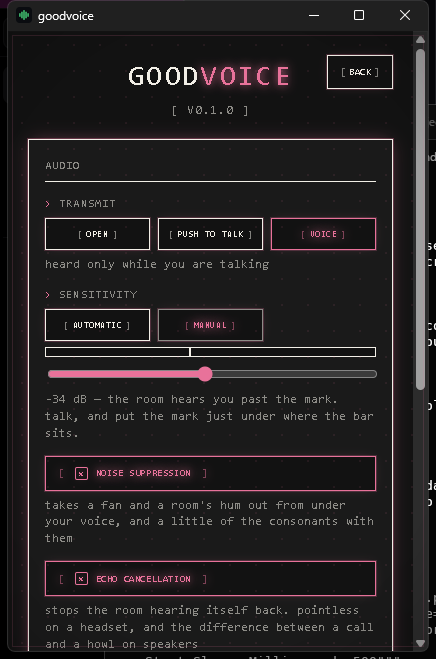

# goodvoice

Lightweight, open-source voice chat for Windows gamers. **Mumble-simple,
Discord-quality, near-zero performance cost.**

Three features. Nothing more:

1. **Voice chat** — rooms of 1–8, no accounts, shareable code or
   `goodvoice://join/<room>` link
2. **System tray** — minimize and forget it while you game; global push-to-talk
   works over a fullscreen game
3. **Screen share** — 720p/1080p, hardware H.264, viewers opt in




## Install

Windows 10/11, x64. Download from the
[latest release](https://github.com/DionathaGoulart/goodvoice/releases/latest):

- `goodvoice_0.1.0_x64-setup.exe` — NSIS, installs per-user into
  `%LOCALAPPDATA%\goodvoice` with no admin prompt, and carries Microsoft's
  WebView2 bootstrapper
- `goodvoice_0.1.0_x64_en-US.msi` — the same app for anyone who deploys by MSI

Verify what you downloaded against `SHA256SUMS.txt` on the same page:

```powershell
Get-FileHash .\goodvoice_0.1.0_x64-setup.exe -Algorithm SHA256
```

The one prerequisite the installer does not carry is the **VC++ 2015–2022 x64
runtime** — the exe imports `VCRUNTIME140.dll`, `VCRUNTIME140_1.dll` and
`MSVCP140.dll`. Most machines with a game on them already have it.

Installing is also what registers the `goodvoice://` scheme, so invite links
only open in an installed client, never in one run out of `target\release`.

## Performance

Budgets are hard requirements, not aspirations (see
[prd.md §4](.harness/prd.md)). Every number below was measured on real
hardware against the live deploy — an RTX 2060 desktop, a HyperX headset out
and a fifine USB microphone in.

| Metric                            | Budget  | Measured                          |
| --------------------------------- | ------- | --------------------------------- |
| End-to-end voice latency          | ≤ 80 ms | **41.4 ms** (21.4 ms wire + 20 ms device period) |
| Idle CPU in a room                | < 2%    | **0.39%** median, 30-min soak     |
| RAM idle in the tray              | ≤ 120 MB| **34.1 MB** peak, 34.0 median     |
| FPS impact sharing 1080p30        | ≤ 6%    | **5.6%** (57.0 → 53.8 fps)        |
| Cold start → audible in the room  | < 3 s   | **2692 ms** median of five runs   |

Two of those have a story worth reading before you quote them:

- **The FPS budget moved.** The PRD asked for "~0" and the measurement came
  back at 5.6%, five to eight times the run's own noise. The budget is now
  ≤ 6% and says so. Where the milliseconds go — 1.8 ms of GPU per shared frame,
  of which NVENC is 0.42 and the BGRA→NV12 convert is most of the rest — is in
  [docs/perf/screenshare-bench.md](docs/perf/screenshare-bench.md) and DR-35.
- **The RAM budget is met by throwing the window away.** Idle in the tray, the
  webview is not suspended, it is gone: 34 MB is the voice client with no
  browser in the process tree. Showing the window rebuilds it in ~130 ms.
  DR-20 and DR-21 have the three levers that were tried and what each measured.

## Screen share


Monitor or window, 720p or 1080p, encoded by NVENC / AMF / QuickSync through
Media Foundation with a software fallback that warns you. Viewers opt in: audio
is never blocked or degraded by video, and a participant who does not open the
viewer subscribes to no video track at all.

## Stack

Rust + Tauri v2 client (WASAPI, Opus, webrtc-rs,
Windows.Graphics.Capture, hardware H.264) · Cloudflare Workers + Durable
Objects for signaling · Cloudflare Realtime SFU for media. No database, no
accounts, rooms are ephemeral and die when the last person leaves.

## Self-hosting

Bring your own free-tier Cloudflare account: create a Realtime app, set
`CALLS_APP_ID` and `CALLS_APP_SECRET`, `wrangler deploy`. Point a client at it
from the settings screen, or bake it in with `GOODVOICE_SERVER` at build time.
Full guide: [docs/self-hosting.md](docs/self-hosting.md).

## What this release has not been through

A measured number nobody has taken is not a promise. Two things this version
claims are tested up to the hardware their test needs and no further, and six
more were never run at all.

**Tested up to the hardware, with the command that finishes them:**

- **The echo canceller has never heard a real room.** It is measured against a
  synthetic loopback, which is the hard case for the estimator and not the real
  one. The instrument for the real one exists and reaches everything but the
  room: `bin/echo-room` sends a 1 200 Hz tone the whole way — SFU, loudspeaker,
  air, microphone, SFU — and it **refuses a verdict** on the only machine here,
  at 0.4 dB and 2.0 dB of coupling against the 6 dB it requires, because that
  machine's only working output is a headset earcup. Put a loudspeaker in front
  of a microphone and the row is one command:
  `cargo run -p goodvoice-harness --bin echo-room -- --record <dir>`. See DR-41
  and [docs/testing/echo.md](docs/testing/echo.md).
- **The installer has never met a machine without the toolchain.** Both bundles
  build, and the installed client was heard by an independent client in the
  same room at 50 frames a second against the live deploy — from an install,
  not from `target\release`. What is unproven is that the bundle carries
  everything a Windows machine that has never had MSVC on it needs.

**Never run, and none of them block this release:**

| | |
| --- | --- |
| Pulling the network mid-call | `bin/reconnect-drill` kills the session from the inside; only a real netdown checks that the client *notices* |
| Four clients conversing | N-party audio is tested; the CPU cost of four at once needs four hosts |
| What a closed viewer still costs | `tracks/close` is unused, so the SFU is never told a viewer went away |
| Keyframe on demand | no `nack pli` / `ccm fir`, so a viewer waits up to 2 s for a picture and a still share re-sends keyframes to nobody |
| The self-hosting guide, followed by a stranger | written and half-measured; nobody has done it on a fresh Cloudflare account |
| Where the window comes back | closing to the tray and reopening walks the window down the screen |

The plan tracks each of these as a task with a definition of done and the
command that proves it: [.harness/plan.md](.harness/plan.md), §7.7 through
§7.12.

## Building it yourself

Windows with MSVC, LLVM, Python (for meson and ninja), Node 24 and a Rust
toolchain. `.github/workflows/ci.yml` is the exact environment, including the
four PATH-ordering traps that make a Windows runner build the wrong thing
(DR-30).

```powershell
cd client
npm ci
npm run tauri build
```

The gates, all of which CI runs on every push:

```powershell
cd client\src-tauri
cargo fmt --all --check
cargo clippy --workspace --all-targets -- -D warnings
cargo test --workspace          # 181 tests
cd ..;        npm run format:check; npm run typecheck
cd ..\server; npm run format:check; npm run typecheck; npm test   # 85 tests
```

## How this was built

Every non-obvious decision is a numbered record in
[.harness/plan.md](.harness/plan.md) — 41 of them, each with what was measured
and what it refuted. A few worth reading on their own: DR-14 (one unreachable
STUN URL hung every join), DR-22 (the release build was a different app than
the one being measured), DR-27 (the installer packaged the wrong binary because
nothing said which of twelve was the app), DR-33 (only the first viewer ever
got a picture).

## License

[MIT](LICENSE)
