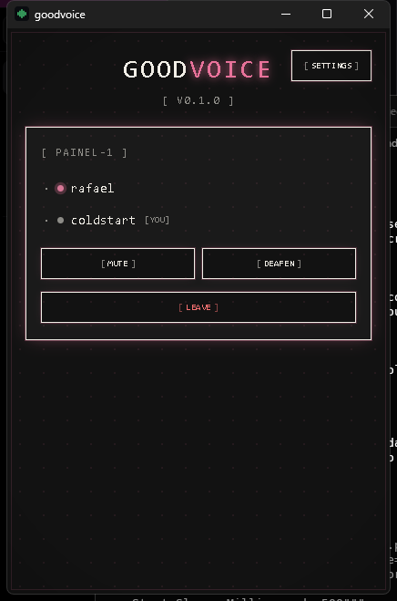
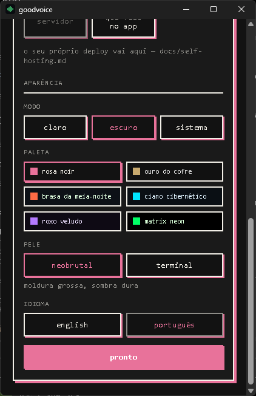
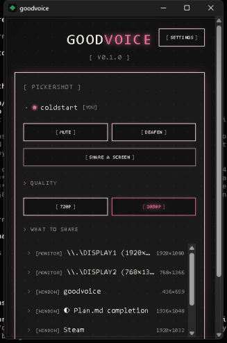
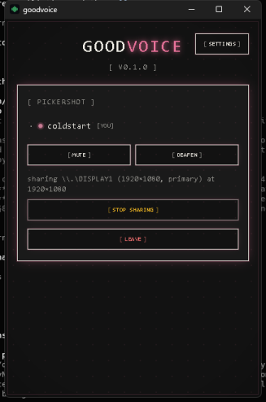
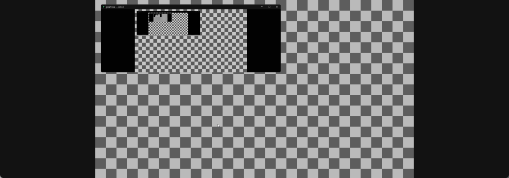
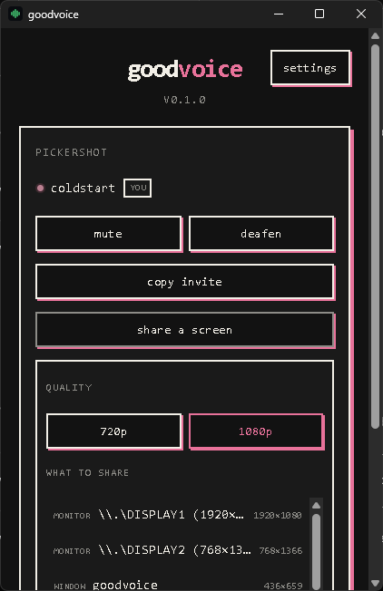

# goodvoice

[English](README.md) · **Português (Brasil)**

Chat de voz leve e de código aberto para quem joga no Windows. **Simples como o
Mumble, com a qualidade do Discord, e um custo de desempenho perto de zero.**

> **A v0.1.1 é uma versão de testes.** Tudo o que está abaixo foi medido, e a
> lista do que **não** passou por teste nenhum está em
> [Por onde esta versão não passou](#por-onde-esta-versão-não-passou) — é uma
> lista de verdade, não um aviso legal. O maior item dela: **nenhuma máquina sem
> a toolchain do Rust instalada jamais instalou isto.**

Três funcionalidades. Nada além disso:

1. **Chat de voz** — salas de 1 a 8 pessoas, sem contas, com um código para
   compartilhar ou um link `goodvoice://join/<sala>`
2. **Bandeja do sistema** — minimize e esqueça enquanto joga; a tecla de falar
   funciona por cima de um jogo em tela cheia
3. **Compartilhamento de tela** — 720p/1080p, H.264 por hardware, e quem assiste
   opta por assistir

Em **inglês e português do Brasil**, escolhido na tela de ajustes e seguido pelo
menu da bandeja. Ele começa no idioma em que a sua máquina está.

**Relatórios de erro ficam desligados até você ligar.** A tela de
configurações pergunta; nada sai da máquina antes de você responder, e a
resposta vale a partir da próxima vez que o app abrir. Um registro rotativo é
escrito localmente de qualquer forma — há um botão que abre a pasta dele, para
anexar numa issue.




> A primeira captura acima é da interface em inglês, as outras desta página
> também. O que elas mostram é o formato; as palavras mudam com o idioma.

## Instalação

Windows 10/11, x64. Baixe da
[última release](https://github.com/DionathaGoulart/goodvoice/releases/latest):

- `goodvoice_0.1.1_x64-setup.exe` — NSIS, instala por usuário em
  `%LOCALAPPDATA%\goodvoice` sem pedir administrador, e leva junto o
  bootstrapper do WebView2 da Microsoft. **Ele pergunta em que idioma
  instalar**: um exe só, com inglês e Português Brasileiro.
- `goodvoice_0.1.1_x64_en-US.msi` / `goodvoice_0.1.1_x64_pt-BR.msi` — o mesmo
  app, para quem instala por MSI. O WiX escreve um arquivo por idioma em vez de
  perguntar, então pegue o que você quer. **Nenhum dos dois leva o WebView2
  junto**: buscam o bootstrapper em `go.microsoft.com/fwlink` na hora da
  instalação, então precisam da rede que o instalador NSIS não precisa.

Confira o que você baixou contra o `SHA256SUMS.txt` da mesma página:

```powershell
Get-FileHash .\goodvoice_0.1.1_x64-setup.exe -Algorithm SHA256
```

O único pré-requisito que nenhum instalador carrega é o **runtime do
VC++ 2015–2022 x64** — o exe importa `VCRUNTIME140.dll`, `VCRUNTIME140_1.dll` e
`MSVCP140.dll`. A maioria das máquinas que tem um jogo instalado já tem isso.

Instalar também é o que registra o esquema `goodvoice://`, então links de
convite só abrem num cliente instalado, nunca num que rodou de
`target\release`.

## Desempenho

Os orçamentos são requisitos rígidos, não aspirações (veja
[prd.md §4](.harness/prd.md)). Todos os números abaixo foram medidos em hardware
real contra o deploy que está no ar — um desktop com RTX 2060, um headset
HyperX na saída e um microfone USB fifine na entrada.

| Métrica                               | Orçamento | Medido                                               |
| ------------------------------------- | --------- | ---------------------------------------------------- |
| Latência de voz ponta a ponta         | ≤ 80 ms   | **41,4 ms** — 21,4 ms de rede + 20 ms do dispositivo |
| CPU ocioso numa sala                  | < 2%      | **0,39%** de mediana, soak de 30 minutos             |
| RAM ocioso na bandeja                 | ≤ 120 MB  | **34,1 MB** de pico, 34,0 de mediana                 |
| Impacto no FPS compartilhando 1080p30 | ≤ 6%      | **5,6%** — de 57,0 fps para 53,8                     |
| Início frio → audível na sala         | < 3 s     | **2692 ms** de mediana em cinco execuções            |

Dois desses têm uma história que vale ler antes de citá-los:

- **O orçamento de FPS mudou.** O PRD pedia "~0" e a medição voltou com 5,6% —
  de cinco a oito vezes o próprio ruído da execução. O orçamento agora é ≤ 6% e
  diz isso. Para onde vão os milissegundos — 1,8 ms de GPU por quadro
  compartilhado, dos quais o NVENC é 0,42 e a conversão BGRA→NV12 é quase todo o
  resto — está em
  [docs/perf/screenshare-bench.md](docs/perf/screenshare-bench.md) e no DR-35.
- **O orçamento de RAM é cumprido jogando a janela fora.** Ocioso na bandeja, a
  webview não está suspensa, ela não existe: 34 MB é o cliente de voz sem
  nenhum navegador na árvore de processos. Mostrar a janela reconstrói tudo em
  ~130 ms. O DR-20 e o DR-21 têm as três alavancas que foram testadas e o que
  cada uma mediu.

Uma medição abaixo não tem orçamento e vale ser citada assim mesmo. **O
cancelador de eco foi medido através de um caminho acústico real**, duas vezes:
um tom de 1 200 Hz fez a viagem inteira — SFU, alto-falante, ar, microfone, SFU
— e se destacou **32 dB** acima da sala com o cancelador desligado, contra
**0,6 dB** com ele ligado. Isso são **31,7 dB de cancelamento**, um resíduo que
fica no nível do ruído da própria sala, e o mesmo número que o AEC3 do WebRTC dá
contra um loopback sintético de atraso zero (31,8 dB). O que _não_ está testado
é um alto-falante distante: o transdutor estava encostado na cápsula do
microfone, então o atraso que o cancelador teve que encontrar era o do pipeline
do dispositivo, e não um metro de ar por cima dele. DR-42 e
[docs/testing/echo.md](docs/testing/echo.md).

## Compartilhamento de tela





Monitor ou janela, 720p ou 1080p, codificado por NVENC / AMF / QuickSync através
do Media Foundation, com um fallback por software que te avisa. Quem assiste
opta por assistir: o áudio nunca é bloqueado nem degradado pelo vídeo, e um
participante que não abre o visualizador não assina nenhuma faixa de vídeo — **e
um visualizador que fecha devolve a assinatura**, que é uma coisa que este
cliente não fazia até que alguém lesse a rede em vez dos contadores de IO do
processo (DR-45).

## Aparência

Dez paletas e duas peles, escolhidas na tela de ajustes e independentes entre
si: a paleta diz quais cores, a pele diz sobre o que elas são pintadas, e toda
paleta funciona sob qualquer uma das peles. Claro e escuro seguem a máquina até
você escolher um.

Toda captura de tela acima é a `terminal` — a ideia que um CRT teria de um
cliente de voz, com prompts e fósforo. A outra pele é a `neobrutal`: moldura
grossa, cantos retos e uma sombra dura, sem borrão nenhum.



Adicionar uma paleta é um bloco em `client/ui/styles/themes.css`, uma entrada em
`client/ui/appearance.ts` e um nome nos dois idiomas — o mesmo verificador de
tipos que guarda as strings guarda isto, então uma paleta sem nome quebra o
build em vez de virar um quadradinho em branco.

## Idioma

Inglês e português do Brasil, do instalador em diante. O setup NSIS pergunta em
que idioma instalar; a janela escolhe um a partir da sua máquina na primeira
execução e lembra o que você escolher depois disso, e o menu da bandeja
acompanha no mesmo clique.

O que **não** está traduzido é o diagnóstico — o que volta de uma entrada que
falhou, de um compartilhamento recusado ou de uma URL de Worker rejeitada é a
frase escrita no lugar onde a falha aconteceu, e ela está em inglês nos dois
idiomas. A superfície é todo caminho de erro do cliente, e traduzir metade
deixaria de fora exatamente a metade que alguém precisa colar num issue.

Adicionar um terceiro idioma é `client/ui/strings.ts` e
`client/src-tauri/src/lang.rs`, e o verificador de tipos quebra o build em
qualquer string que um dos dois esquecer.

## Stack

Cliente em Rust + Tauri v2 (WASAPI, Opus, webrtc-rs, Windows.Graphics.Capture,
H.264 por hardware) · Cloudflare Workers + Durable Objects para sinalização ·
Cloudflare Realtime SFU para mídia. Sem banco de dados, sem contas, e as salas
são efêmeras: morrem quando a última pessoa sai.

Os relatórios são Sentry nas duas pontas — `sentry` e `tauri-plugin-sentry` no
cliente, `@sentry/cloudflare` no Worker — e os dois são compilados junto, não
configurados. Uma build sem DSN dentro, que é toda build feita a partir do
código, não reporta a lugar nenhum e não precisa de opção para desligar; uma
build que tem um DSN ainda assim não envia nada enquanto a tela de ajustes não
for respondida.

## Hospedando você mesmo

Traga sua própria conta gratuita da Cloudflare: crie um app Realtime, defina
`CALLS_APP_ID` e `CALLS_APP_SECRET`, `wrangler deploy`. Aponte um cliente para
ela na tela de ajustes, ou embuta com `GOODVOICE_SERVER` na hora de compilar.
Guia completo: [docs/self-hosting.md](docs/self-hosting.md) (em inglês).

## Por onde esta versão não passou

Um número que ninguém mediu não é uma promessa. Uma coisa que esta versão
afirma está testada até o limite do hardware que o teste dela precisa e nada
além disso, e outras quatro nunca foram executadas. **É isso que faz da v0.1.1
uma versão de testes e não uma 1.0.**

**Testado até onde o hardware permitiu, com o comando que termina o serviço:**

- **O instalador nunca encontrou uma máquina sem a toolchain.** Os dois bundles
  compilam, e o cliente instalado foi ouvido por um cliente independente na
  mesma sala a 50 quadros por segundo contra o deploy que está no ar — a partir
  de uma instalação, não de `target\release`. O que não está provado é que o
  bundle carrega tudo o que uma máquina Windows que nunca teve o MSVC precisa.
  Este é o item desta página com mais chance de te morder, e o que mais vale a
  pena nos contar.

**Nunca executados, e nenhum deles bloqueia esta versão:**

| O quê                                         | Por que continua em aberto                                                                                             |
| --------------------------------------------- | ---------------------------------------------------------------------------------------------------------------------- |
| Derrubar a rede no meio de uma chamada        | o `bin/reconnect-drill` mata a sessão por dentro; só uma queda real verifica que o cliente _percebe_                   |
| Quatro clientes conversando                   | o áudio N-para-N está testado; o custo de CPU de quatro ao mesmo tempo precisa de quatro máquinas                      |
| O guia de auto-hospedagem, seguido por alguém | escrito e medido pela metade; ninguém o seguiu numa conta Cloudflare nova                                              |
| Um alto-falante a um metro                    | o cancelador foi medido com o transdutor encostado na cápsula, o que é um atraso menor que o de uma caixa sobre a mesa |
| O segundo processo do repórter de crash       | `minidump::init` reexecuta o binário, e nenhuma build com DSN dentro foi executada — o caminho dos dois processos nunca subiu. `bin/crash-drill --kind processes` é o que confere |
| O que o repórter de crash custa               | os orçamentos de RAM e início a frio da §4 foram medidos sem ele. O soak amostra a árvore de processos, então um segundo processo cai nos dois |

O plano acompanha cada um deles como uma tarefa com uma definição de pronto e o
comando que a prova: [.harness/plan.md](.harness/plan.md), §7.7, §7.8, §7.11 e
§7.13.

**Um visualizador que abre sobre um compartilhamento parado espera até 2,5 s
pela primeira imagem.** Isso estava na lista acima como algo a corrigir e não é
corrigível daqui: a Cloudflare nunca pede uma imagem a este cliente — `nack pli`
está na oferta e o contador de pedidos do publicador nunca saiu de zero — e um
compartilhamento que não envia nada é um compartilhamento que ninguém consegue
assinar. Medido, com o drill que mede, em
[.harness/plan.md](.harness/plan.md) §7.10 e no DR-44.

## Compilando você mesmo

Windows com MSVC, LLVM, Python (para meson e ninja), Node 24 e uma toolchain
Rust. O `.github/workflows/ci.yml` é o ambiente exato, incluindo as quatro
armadilhas de ordem no PATH que fazem um runner Windows compilar a coisa errada
(DR-30).

```powershell
cd client
npm ci
npm run tauri build
```

Os gates, todos eles rodados pela CI a cada push:

```powershell
cd client\src-tauri
cargo fmt --all --check
cargo clippy --workspace --all-targets -- -D warnings
cargo test --workspace          # 197 testes
cd ..;        npm run format:check; npm run typecheck
cd ..\server; npm run format:check; npm run typecheck; npm test   # 85 testes
```

## Como isto foi construído

Toda decisão não óbvia é um registro numerado em
[.harness/plan.md](.harness/plan.md) — 46 deles, cada um com o que foi medido e
o que aquilo refutou. Alguns que valem a leitura por si só: DR-14 (uma única URL
de STUN inalcançável travava toda entrada), DR-22 (a build de release era um app
diferente do que estava sendo medido), DR-27 (o instalador empacotou o binário
errado porque nada dizia qual dos doze era o app), DR-33 (só o primeiro
visualizador recebia imagem) e DR-45 (um visualizador fechado continuava
recebendo o compartilhamento inteiro, e os contadores de IO do próprio Windows
não conseguiam ver isso). Os registros estão em inglês.

## Licença

[MIT](LICENSE)
