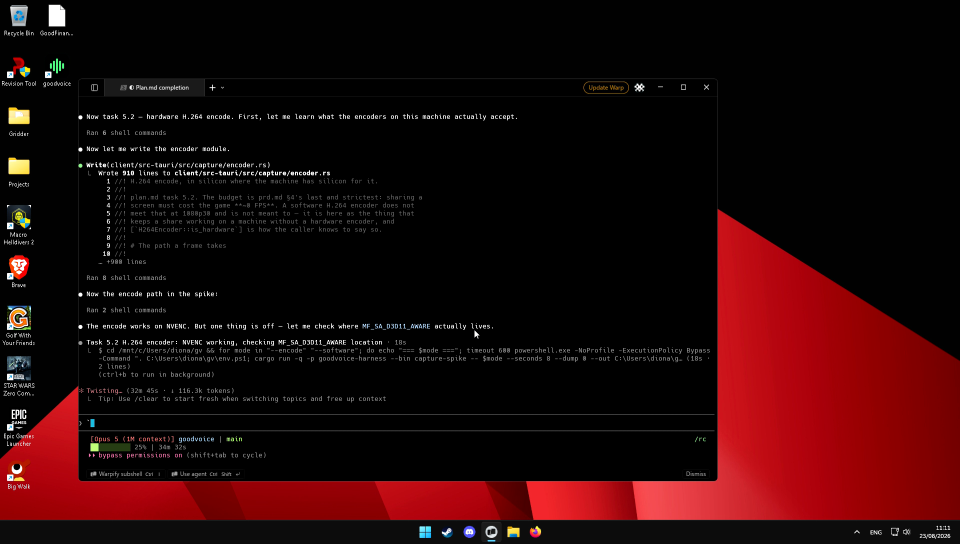

# What the H.264 encoder produced, and how it was checked

plan.md task 5.2's committed sample analysis. Everything below came out of one
command on one machine, and every number in it is reproducible by running that
command again.

## The machine and the command

Windows 11 (10.0.26200), NVIDIA GeForce RTX 2060, 1920×1080 primary display —
the same host as DR-12 and DR-31.

```text
cargo run -p goodvoice-harness --bin capture-spike -- --encode   --seconds 8 --dump 0 --out <dir>
cargo run -p goodvoice-harness --bin capture-spike -- --software --seconds 8 --dump 0 --out <dir>
```

Each writes two files into `<dir>`: `capture.h264`, the Annex B elementary
stream exactly as the encoder produced it, and `capture.mp4`, the same packets
muxed without re-encoding so a person can double-click them.

`--software` is not a machine without a GPU. It skips every hardware encoder on
a machine that has three, which is the only way to see the fallback — and the
warning it prints — on the hardware this was developed on.

## What the machine offers

```text
- NVIDIA H.264 Encoder MFT — hardware, takes D3D11 textures
- Microsoft AVC DX12 Encoder — hardware, takes D3D11 textures
- H264 Encoder MFT — software, memory buffers only
```

Two hardware paths, which matches the 0.5 probe (DR-12). The first is the one
`H264Encoder::open` takes.

## The two runs

Both captured the primary display for 8 seconds, asked for 1920×1080 at 30 fps
and 6 Mbps, and were fed every frame WGC produced.

| | NVIDIA H.264 Encoder MFT | H264 Encoder MFT (software) |
|---|---|---|
| frames in → packets out | 143 → 143 | 133 → 133 |
| bytes | 2 022 388 | 759 298 |
| measured bitrate | 2 015 kbps | 752 kbps |
| **per frame in `encode`** | **0.42 ms** | **8.43 ms** |
| worst frame | 1.52 ms | 50.59 ms |
| takes the D3D11 texture | yes | no — every frame is copied out of GPU memory |

One packet per frame, in both: neither encoder holds frames back, so the
latency the share adds is one frame plus the encode.

**The 20× is the whole of task 5.2.** At 8.43 ms a frame the software encoder
spends a quarter of a 30 fps budget on the CPU that the game is also using, and
the worst frame is longer than a frame period — a visible hitch. At 0.42 ms
the encoder is not the thing the FPS benchmark (task 5.5) will find.

Neither run reached the 6 Mbps it asked for, and that is the content rather
than the encoder: a mostly-static terminal on a mostly-static desktop has very
little to code. The number to read is the ratio, not the absolute.

## The bitstream

`capture.h264` from the hardware run, counted by NAL unit type:

| NAL | what | count |
|---|---|---|
| 9 | access unit delimiter | 143 |
| 7 | sequence parameter set | 5 |
| 8 | picture parameter set | 5 |
| 5 | IDR slice | 5 |
| 1 | non-IDR slice | 138 |

143 access units for 143 frames, each opened by a delimiter. **The parameter
sets repeat with every keyframe** rather than appearing once at the head —
five SPS, five PPS, five IDRs. That is what task 5.4 needs: a viewer opening
the window mid-share can start at the next keyframe without having been sent
anything earlier.

Keyframes land every ~29 frames, about one a second at the rate the content
was moving.

The SPS, decoded:

```text
profile_idc = 77 (Main), level_idc = 40 (level 4.0)
coded 1920×1088, frame_crop_bottom = 4  →  displayed 1920×1080
frame_mbs_only = 1 (progressive)
```

1080 is not a multiple of 16, so H.264 codes 1088 rows and crops eight of them
away in the SPS. A decoder that honours the crop shows 1920×1080; VLC's frame
dumper does not, which is why the images below are 1088 tall.

The software run is the same shape — Main profile, level 4.0, same crop, five
keyframes — plus two SEI messages the hardware encoder does not emit.

## Does it play

`capture.h264` and `capture.mp4` were both opened in **VLC 3**, which decodes
with libavcodec and has nothing to do with Media Foundation. Neither reported a
bitstream error; VLC's log says it picked up D3D11VA hardware decoding and ran
to the end of the playlist.

A frame decoded out of the mp4 by VLC:



That is the desktop that was captured, in the right colours, with the cursor in
it — so the whole path, BGRA capture → `VideoProcessorBlt` → NV12 → NVENC →
Annex B → mp4 → an unrelated decoder, is intact end to end.

To reproduce the frame dump:

```text
"C:\Program Files\VideoLAN\VLC\vlc.exe" -I dummy --no-audio --play-and-exit ^
  --video-filter=scene --scene-format=png --scene-ratio=100 ^
  --scene-prefix=mp4 --scene-path=<dir> <dir>\capture.mp4
```

## What is not measured here

What capture and encode together cost a game. That is task 5.5, it needs a
GPU-bound workload to measure against, and 0.42 ms a frame is an argument that
it will be small rather than a demonstration that it is.
